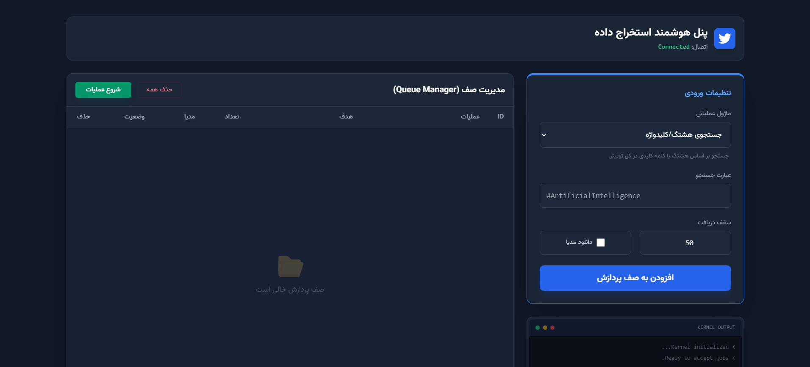

# 🐦 Twitter Scraper UI

A full-stack web-based tool for scraping Twitter (X) data with a clean user interface, queue system, and real-time logging.

---

## 🚀 Features

- 🔍 **Search:** Search tweets by keyword or hashtag.
- 💬 **Extraction:** Extract full tweet replies and threads.
- 👤 **Profiles:** Scrape user profiles and timelines.
- 📦 **Queue System:** Manage multiple scraping requests efficiently.
- ⚙️ **Batch Processing:** Automatic sequential execution of tasks.
- 📡 **Real-time Logs:** Live log streaming directly to the UI.
- 🖼️ **Media:** Optional image/media downloading.
- 📥 **Export:** Download results as a ZIP file.

---

## 🧠 How It Works

This project is built as a **client-server application**:

### 🖥 Frontend
- HTML, CSS, JavaScript
- Queue management UI
- Task status display (pending / processing / completed)
- Live logs viewer

### ⚙️ Backend
- Python (FastAPI/Flask)
- Handles scraping requests
- Manages queue system
- Streams logs to frontend

---

## 📂 Project Structure

```text
Twitter-scraper/
├── main.py                # Main backend server
├── scraper.py             # Tweet scraping logic
├── profile_scraper.py     # Profile scraping logic
├── index.html             # Frontend UI
├── script.js              # Frontend logic
├── style.css              # UI styling
├── requirements.txt       # Dependencies
└── README.md
```
🛠 Installation
1. Clone the repository
```
git clone [https://github.com/amirreza4521/Twitter-scraper-.git](https://github.com/amirreza4521/Twitter-scraper-.git)
cd Twitter-scraper-
```
2. Create virtual environment
```aiignore
# Windows
python -m venv .venv
.venv\Scripts\activate

# Linux / Mac
python -m venv .venv
source .venv/bin/activate
```
3. Install dependencies
```aiignore
pip install -r requirements.txt
```
▶️ Run the Project
```aiignore
python main.py
```
## API Endpoints
/start-scrape
```aiignore
{
  "mode": "search | comments | profile",
  "url": "input query or tweet URL",
  "count": 50,
  "download_img": true
}
```
### 📸 Screenshots


⚠️ Disclaimer
This project is for educational purposes only. Please use it responsibly and respect Twitter (X) terms of service.